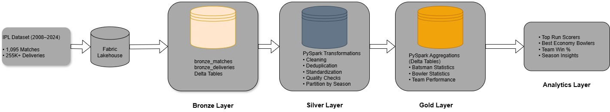
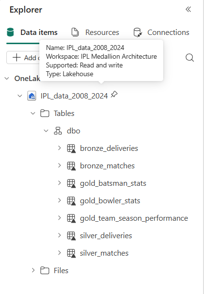
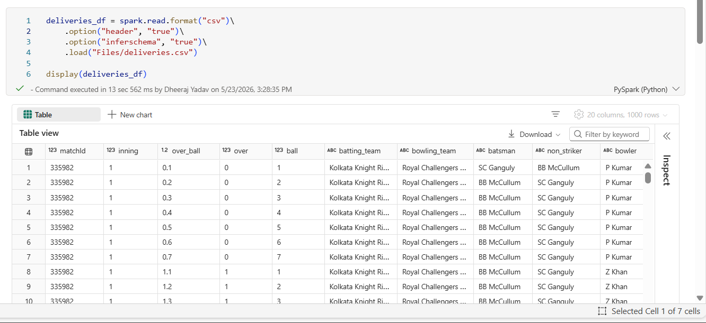
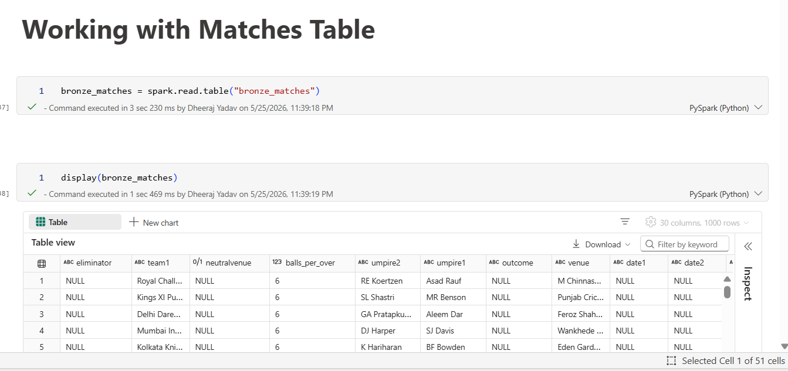
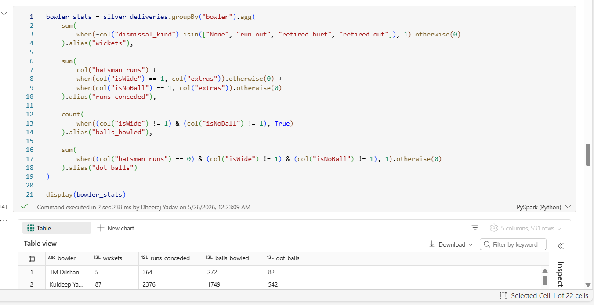

# IPL Data Lakehouse on Microsoft Fabric


## Project Overview

An end-to-end IPL Analytics Lakehouse built on **Microsoft Fabric** using **Medallion Architecture (Bronze → Silver → Gold)**.

The pipeline ingests 260,920+ ball-by-ball records spanning **17 IPL seasons (2008–2024)** across 1,095 matches and 74 venues — storing raw data in Delta Lake tables, applying rigorous data cleaning and quality validation using PySpark, and generating analytical Gold-layer tables for batting, bowling, and team performance KPIs.

The project demonstrates modern data engineering practices including Lakehouse architecture, Delta Lake transactional storage, PySpark transformations, partitioned storage, and business KPI generation — all orchestrated natively within Microsoft Fabric.

---

## Architecture



---

## Dataset Overview

**Source:** IPL Match & Delivery Dataset (2008–2024) — [Kaggle](https://www.kaggle.com/datasets/dgsports/ipl-ball-by-ball-2008-to-2024)

| Metric           | Value   |
|------------------|---------|
| Seasons Covered  | 17      |
| Matches          | 1,095   |
| Venues           | 74      |
| Deliveries       | 260,920 |

---

## Technology Stack

| Technology              | Purpose                        |
|-------------------------|--------------------------------|
| Microsoft Fabric        | Lakehouse Platform             |
| OneLake                 | Unified Cloud Storage          |
| Fabric Data Pipelines   | Pipeline Orchestration         |
| Delta Lake              | Transactional Table Storage    |
| PySpark                 | Data Transformation            |
| SQL Analytics Endpoint  | Business KPI Queries           |
| Medallion Architecture  | Bronze → Silver → Gold Layering|

---

## Medallion Architecture

### Bronze Layer — Raw Ingestion

Raw data is ingested as-is from source CSVs into Delta Lake tables via **Fabric Data Pipelines** with no transformations applied, preserving full historical fidelity.

**Tables:**
- `bronze_matches`
- `bronze_deliveries`

**Features:**
- Raw CSV ingestion via Fabric Data Pipelines
- Delta table storage on OneLake
- Immutable historical data
- Full source preservation with ingestion metadata

---

### Silver Layer — Cleaning & Standardisation

PySpark transformations clean, validate, and standardise the raw data into a query-safe layer, partitioned by season for downstream performance.

**Transformations Applied:**
- Null imputation across 6 columns (`winner_runs`, `winner_wickets`, `method`, `outcome`, `eliminator`, `date`)
- Derived column `result_type` added — classifies every match as Won by Runs / Won by Wickets / Tie / No Result
- Team name standardisation across 3 historical franchise variants
- Date column cast from string to `DateType` for time-series analysis
- Whitespace trimming applied to all string join keys (`team1`, `team2`, `winner`, `toss_winner`)
- 3 duplicate delivery records removed
- Irrelevant columns dropped (`date1`, `date2`, `neutralvenue`, `balls_per_over`)
- Season-based partitioning applied on both tables for optimised Gold layer queries

**Team Name Standardisation:**

| Original                | Standardised             |
|-------------------------|--------------------------|
| Delhi Daredevils        | Delhi Capitals           |
| Kings XI Punjab         | Punjab Kings             |
| Rising Pune Supergiant  | Rising Pune Supergiants  |

---

### Gold Layer — Business KPIs

Aggregated, business-ready analytical tables built from Silver data, queried directly via the Fabric SQL Analytics Endpoint.

**Tables:**

#### `gold_batsman_stats`
- Total runs, balls faced, strike rate
- Fours, sixes
- Career aggregates per batter

#### `gold_bowler_stats`
- Wickets, overs bowled
- Economy rate, dot-ball percentage

#### `gold_team_season_performance`
- Matches played, wins, win percentage
- Season-wise performance per team

---

## Project Metrics

### Bronze Layer

| Metric           | Value   |
|------------------|---------|
| Tables Created   | 2       |
| Match Records    | 1,095   |
| Delivery Records | 260,920 |

### Silver Layer

| Metric                              | Value   |
|-------------------------------------|---------|
| Match Records                       | 1,095   |
| Delivery Records (after dedup)      | 260,917 |
| Duplicate Records Removed           | 3       |
| Columns with Null Imputation        | 6       |
| Derived Columns Added               | 1       |
| Columns Dropped                     | 4       |
| Team Name Variants Standardised     | 3       |
| Seasons Partitioned                 | 17      |

### Gold Layer

| Metric                    | Value |
|---------------------------|-------|
| Batsman Records           | 674   |
| Bowler Records            | 531   |
| Team Performance Records  | 146   |
| Gold Tables Created       | 3     |

---

## Example Analytics Queries

### Top 10 Run Scorers (All Time)
```sql
SELECT batter, total_runs
FROM gold_batsman_stats
ORDER BY total_runs DESC
LIMIT 10;
```

### Most Economical Bowlers (Min 50 Overs)
```sql
SELECT bowler, economy
FROM gold_bowler_stats
WHERE overs > 50
ORDER BY economy ASC;
```

### Team Win Percentage by Season
```sql
SELECT team, AVG(win_percentage) AS avg_win_percentage
FROM gold_team_season_performance
GROUP BY team
ORDER BY avg_win_percentage DESC;
```

---

## Repository Structure

```
ipl-fabric-lakehouse/
│
├── notebooks/
│   ├── bronze_ingestion.ipynb
│   ├── silver_transformation.ipynb
│   └── gold_aggregation.ipynb
│
├── architecture/
│   └── architecture.jpg
│
├── screenshots/
│   ├── delta_tables.png
│   ├── bronze_notebook.png
│   ├── silver_notebook.png
│   └── gold_notebook.png
│
├── sql/
│   └── analytics_queries.sql
│
├── datasets/
│   └── dataset_link.txt
│
├── project_metrics.md
├── requirements.txt
└── README.md
```

---

## Screenshots

### Lakehouse Overview


### Bronze Notebook


### Silver Notebook


### Gold Notebook


---

## Future Enhancements

- Incremental data loading using Fabric Pipeline watermarking
- Real-time IPL match streaming via Fabric Eventstream
- Match outcome prediction using ML on Gold layer features
- Advanced player performance analytics (powerplay vs death overs split)